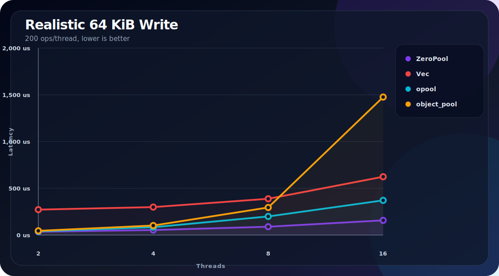
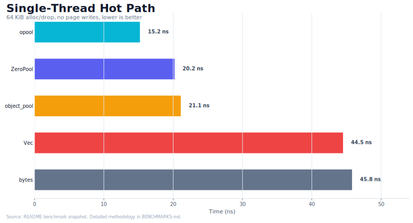

# ZeroPool

A user-space byte allocator that recycles buffers so the kernel work happens once.

[](https://crates.io/crates/zeropool)
[](https://docs.rs/zeropool)
[](https://github.com/botirk38/zeropool/actions)

## About

Every `Vec::with_capacity(n)` asks the kernel for memory, and every `drop` gives it back. Under load (especially multi-threaded) this becomes the bottleneck: page faults, `mmap` syscalls, allocator contention.

ZeroPool keeps a pool of reusable byte buffers organized by size class. Buffers are handed out through thread-local caches backed by a lock-free shared queue, so the hot path is a TLS pop with no locks or atomics. When you're done, the buffer goes back to the pool instead of the OS.

The safe default, `alloc(size)`, returns zero-initialized readable bytes. For full-overwrite workloads, `alloc_uninit(size)` skips zeroing and uses a `BufUninit` type that cannot be read from safe code until initialized.

## Features

- **Size-class bucketing**: 8 power-of-two classes (4 KB to 64 MB), O(1) class selection
- **Lock-free shared pool**: [`crossbeam::ArrayQueue`](https://docs.rs/crossbeam-queue) per class, no mutexes
- **Thread-local caching**: per-class LIFO caches with magazine-style batch transfer
- **Pool isolation**: unique pool IDs prevent TLS cache cross-contamination
- **Safe by default**: `alloc()` zeroes visible bytes so recycled contents are not exposed
- **Explicit fast path**: `alloc_uninit()` avoids zeroing for callers that fully overwrite
- **Pluggable allocator**: custom buffer creation via the [`Allocator`](https://docs.rs/zeropool/latest/zeropool/trait.Allocator.html) trait
- **Pinned memory**: optional `mlock` to keep buffers out of swap
- **Opt-in stats**: atomic counters for hit rates, allocations, and discards (disabled by default)

## Installation

```bash
cargo add zeropool
```

Requires Rust 2024 edition (1.85+).

## Usage

```rust
use zeropool::ZeroPool;

let pool = ZeroPool::new();

let mut buf = pool.alloc(1024 * 1024); // 1 MB, zero-initialized RAII guard
buf[0] = 42;                            // Deref<Target = [u8]>
// returned to pool on drop
```

For the fastest path, initialize through `BufUninit` and convert after all bytes are written:

```rust
use zeropool::ZeroPool;

let pool = ZeroPool::new();
let buf = pool.alloc_uninit(5).write_from_slice(b"hello");

assert_eq!(&*buf, b"hello");
```

### Sharing across threads

`ZeroPool` is `Send + Sync`. Each thread gets its own TLS cache automatically.

```rust
use std::sync::Arc;
use std::thread;
use zeropool::ZeroPool;

// Scoped threads: borrow directly
let pool = ZeroPool::new();
thread::scope(|s| {
    s.spawn(|| { let _buf = pool.alloc(4096); });
    s.spawn(|| { let _buf = pool.alloc(4096); });
});

// Owned threads: wrap in Arc
let pool = Arc::new(ZeroPool::new());
let p = Arc::clone(&pool);
thread::spawn(move || { let _buf = p.alloc(4096); });
```

`Buf<'_>` is lifetime-bound to the pool. Use `buf.into_vec()` when you need an owned `Vec<u8>`.

### Configuration

```rust
use zeropool::ZeroPool;

let pool = ZeroPool::new()
    .tls_cache_size(8)           // per-class per-thread cache depth
    .max_buffers_per_class(64)   // shared pool capacity per class
    .min_buffer_size(4096)       // skip pooling for small buffers
    .batch_size(4)               // TLS <-> shared transfer size
    .track_stats(true)           // opt into atomic counters
    .pinned_memory(true);        // mlock buffers (no swap)
```

### Pluggable allocator

Implement the `Allocator` trait to control how buffers are created:

```rust
use zeropool::{Allocator, ZeroPool};

struct HugePageAllocator;
impl Allocator for HugePageAllocator {
    fn allocate(&self, capacity: usize) -> Vec<u8> {
        vec![0; capacity]
    }
}

let pool = ZeroPool::new().allocator(HugePageAllocator);
```

### Stats

Stats are disabled by default because even `Relaxed` atomics are measurable in tight allocation loops (~10 ns overhead). Enable them when you need counters:

```rust
use zeropool::ZeroPool;

let pool = ZeroPool::new().track_stats(true);

let _buf = pool.alloc(4096);

let s = pool.stats();
println!("{s}");
// gets: 1 | puts: 0 | hit_rate: 0.0%
//   tls_hits: 0 (0.0%) | shared_hits: 0 | allocations: 1 | discards: 0 | oversize: 0
```

## Performance

Every "realistic" benchmark writes to every page of the buffer, paying the page-fault cost that dominates real workloads (networking, serialization, file I/O). Pure alloc/drop microbenchmarks hide this cost. Use `alloc_uninit()` for the historical non-zeroing fast path when your workload fully overwrites the buffer.

### Realistic 64 KiB write, 200 ops/thread



| Threads | ZeroPool | `Vec` | `opool` | `object_pool` |
|---------|---------:|------:|--------:|--------------:|
| 2       |  35 us   | 272 us | 40 us  |  45 us |
| 4       |  54 us   | 299 us | 84 us  | 102 us |
| 8       |  89 us   | 388 us | 199 us | 295 us |
| 16      | 157 us   | 624 us | 371 us | 1,476 us |

ZeroPool is **4x-8x faster** than raw `Vec` and scales linearly while `object_pool` collapses under contention.

### Single-thread hot path (no page writes, 64 KiB)



| Crate | Time |
|---|---:|
| `opool` | 15.2 ns |
| **ZeroPool** | 20.2 ns |
| `object_pool` | 21.1 ns |
| `bytes::BytesMut` | 45.8 ns |
| `Vec::with_capacity` | 44.5 ns |

`opool` wins single-thread microbenchmarks by ~5 ns. ZeroPool wins everywhere else.

Full methodology, sustained throughput, burst allocation, mixed-size, and contention sweep results are in [`BENCHMARKS.md`](./BENCHMARKS.md).

```bash
cargo bench                     # ZeroPool-only timing
cargo bench --features bench    # full comparison suite
cargo bench -- realistic        # just the write workloads
cd scripts && uv run python bench.py --current --charts
cd scripts && uv run python bench.py --filter realistic_write_mt --charts
```

## How It Works

```text
Thread 1            Thread 2            Thread N
+------------+     +------------+     +------------+
| TLS Cache  |     | TLS Cache  |     | TLS Cache  |  <-- lock-free
| [class 0]  |     | [class 0]  |     | [class 0]  |      per-class
| [class 1]  |     | [class 1]  |     | [class 1]  |      LIFO caches
|   ...      |     |   ...      |     |   ...      |
+-----+------+     +-----+------+     +-----+------+
      |  batch            |  batch           |  batch
      +----------+--------+------------------+
                 |
         +-------v--------+
         |  Shared Pool   |
         | (lock-free)    |
         |                |
         | [4KB  queue]   |  ArrayQueue per class
         | [16KB queue]   |  CAS-based push/pop
         | [64KB queue]   |
         | [256KB queue]  |
         | [1MB  queue]   |
         | [4MB  queue]   |
         | [16MB queue]   |
         | [64MB queue]   |
         +----------------+
```

1. `pool.alloc(size)` rounds up to the next power-of-two size class
2. Check the thread-local cache for that class. **Hot path (~20 ns), no synchronization**
3. On TLS miss, batch-transfer from the shared `ArrayQueue` (CAS-only, no mutex)
4. On shared miss, allocate fresh from the system (or the custom `Allocator`)
5. On drop, buffer returns to TLS cache; overflow spills back to the shared queue

## Contributing

Contributions are welcome!

### Development setup

```bash
git clone https://github.com/botirk38/zeropool.git
cd zeropool
cargo build
cargo test
```

### Running benchmarks

```bash
cargo bench                     # ZeroPool-only
cargo bench --features bench    # with comparison crates
```

### Code quality

The project uses strict Clippy lints (`clippy::pedantic`, `clippy::perf`, `clippy::correctness` at deny level). Before submitting:

```bash
cargo clippy --all-targets --all-features
cargo fmt --check
```

## Documentation

- [API docs on docs.rs](https://docs.rs/zeropool)
- [Detailed benchmarks](./BENCHMARKS.md)
- [Changelog](./CHANGELOG.md)

## License

Licensed under either of [Apache License, Version 2.0](http://www.apache.org/licenses/LICENSE-2.0) or [MIT License](http://opensource.org/licenses/MIT) at your option.
